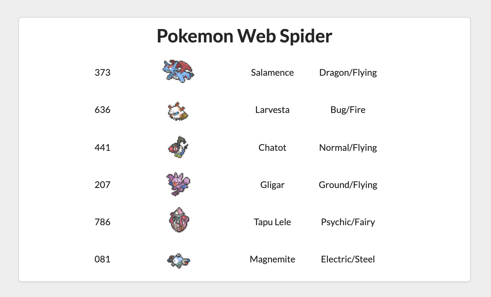

# Pokemon Web Spider Challenge by HackEPS2019

[](http://hits.dwyl.io/AlbertSuarez/hackeps-pokemonwebspider)
[](https://GitHub.com/AlbertSuarez/hackeps-pokemonwebspider/stargazers/)
[](https://GitHub.com/AlbertSuarez/hackeps-pokemonwebspider/network/)
[](https://github.com/AlbertSuarez/hackeps-pokemonwebspider)
[](https://GitHub.com/AlbertSuarez/hackeps-pokemonwebspider/graphs/contributors/)
[](https://github.com/AlbertSuarez/hackeps-pokemonwebspider/blob/master/LICENSE)

🕷 "Pokemon Web Spider" challenge solution from HackEPS

## Problem

The 2nd challenge before the 2019 HackEPS, will consist of a scrapper Pokémon that will have to show the results in html format.

This challenge is to create a team of 6 double type Pokémon (plant / water, fire / electric) without repeating any. In addition, to do it, you have to look in the html of the pokémonDB and show the 6 pokémon (sprite, types, pokédex number and name).

As an additional RESTRICTION, you can not put Pokémon from the same evolutionary chain, for example, you can put eevee, but then all its evolutions are ruled out (eevee, flareon, vaporeon, jolteon ...).

If the solution is hardcoded, it will be invalidated.

An HTML must be delivered with the solution to the problem and the code used to obtain the solution.

## Links

- [PokemonDB](https://pokemondb.net/)
- [BeautifulSoup](https://www.crummy.com/software/BeautifulSoup/bs4/doc/)
- [Selenium](https://www.seleniumhq.org/docs/03_webdriver.jsp)

## Result

Open the following [link](https://asuarez.dev/hackeps-pokemonwebspider) to check the HTML result.



## Requirements

This project is using Python3.7. Third-party libraries listed in [requirements.lock](requirements.lock).

## Recommendations

Usage of [virtualenv](https://realpython.com/blog/python/python-virtual-environments-a-primer/) is recommended for package library / runtime isolation.

## Usage

To run this script, please execute the following from the root directory:

1. Setup virtual environment

2. Install requirements
   ```bash
   pip3 install -r requirements.lock
   ```

3. Run the script
   ```bash
   python3 -m src
   ```
  
> `index.html` was generated.

## Authors

- [Albert Suàrez](https://github.com/AlbertSuarez)

## License

MIT © Albert Suarez
